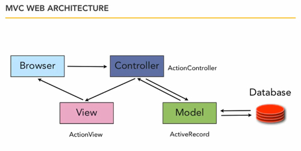

# Model-View-Controller (MVC)

## Ruby on Rails MVC Framework

The Model View Controller principle divides the work of an application into three separate but closely cooperative subsystems.

### Model (ActiveRecord) :

Maintains the relationship between Object and Database and handles validation, association, transactions, and more.

This subsystem is implemented in ActiveRecord library which provides an interface and binding between the tables in a relational database and the Ruby program code that manipulates database records. Ruby method names are automatically generated from the field names of database tables, and so on.

### View ( ActionView )

A presentation of data in a particular format, triggered by a controller's decision to present the data. They are script based templating systems like JSP, ASP, PHP and very easy to integrate with AJAX technology.

This subsystem is implemented in ActionView library which is an Embedded Ruby (ERb) based system for defining presentation templates for data presentation. Every Web connection to a Rails application results in the displaying of a view.

### Controller ( ActionController ):

The facility within the application that directs traffic, on the one hand querying the models for specific data, and on the other hand organizing that data (searching, sorting, massaging it) into a form that fits the needs of a given view.

This subsystem is implemented in ActionController which is a data broker sitting between ActiveRecord (the database interface) and ActionView (the presentation engine).

## References

- [Steps to start the Rails project](https://gist.github.com/mddub/8a4c770edb04b22d5ead)

## Images

### The MVC Framework

